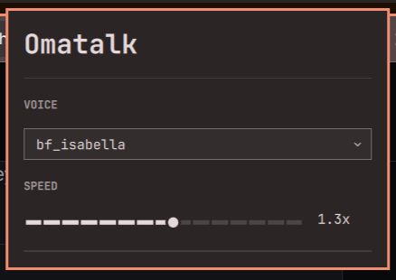

# Omatalk

Local text-to-speech for [Omarchy](https://omarchy.org). Select text, press a
hotkey, hear it read back. The reverse of dictation: instead of you talking to
the machine, it talks to you. Fully local, no network calls at runtime.

## How it works

1. Highlight text anywhere in Hyprland.
2. Press `F8`, next to Omarchy's `F9` dictation key: F9 speaks you, F8 speaks
   back.
3. Omatalk reads the highlighted text, or the clipboard if nothing is
   selected. It streams the text sentence by sentence through
   [Kokoro-82M](https://huggingface.co/hexgrad/Kokoro-82M) (ONNX, CPU) and
   plays it over PipeWire as each sentence finishes synthesizing.
4. Press `F8` again while it's speaking to interrupt. If the selection hasn't
   changed, speech just stops. If it has, the old sentence cuts off and the
   new one starts.

On Omarchy, the bar shows a megaphone in the normal bar color and switches it to
the active color while Omatalk is speaking.

## Bar states

The bar keeps one megaphone icon in the same spot and changes its color:

- `idle`: normal bar color; the daemon is ready.
- `speaking`: theme accent; selected text is being read.
- `unavailable`: urgent color after a 3-second disconnect grace period.

The live bar context is softened around the Omatalk glyph so the state colors are easy to spot.

### Idle

The daemon is ready and the icon uses the normal bar color.


### Speaking

Omatalk is reading the current selection in the theme accent color.


### Unavailable

The daemon has been disconnected long enough to show the urgent color.


## Install

On an Omarchy machine:

```sh
curl -fsSL https://omatalk.zerobearing.com/install.sh | bash
```

The script downloads the latest release tarball (checksum-verified), then:

1. Checks system dependencies and installs any missing ones via
   `omarchy pkg add` (python, curl, pipewire, wl-clipboard, uv; stock
   Omarchy usually only lacks uv).
2. Downloads the Kokoro-82M model and voice files (~185MB) to
   `~/.local/share/omatalk/models/`, skipped when their checksums match —
   deliberately while any existing daemon is still running, since models
   are only read at startup.
3. Stops any existing daemon, rebuilds the uv-managed venv at
   `~/.local/share/omatalk/venv/`, and installs and enables a fresh
   `omatalk.service` systemd user unit, so the new daemon is running
   before the command exits.
4. Puts `omatalk` on `PATH`, installs and refreshes the Omarchy bar plugin, and
   prints a copy-paste command to add the F8 binding when no Omatalk binding is
   present. The installer never edits your keybindings itself.

Every push to `master` tags a new release automatically. Re-running the
installer picks up whatever is newest. After the first run of this installer,
`omatalk upgrade` fetches and runs the same latest installer.

Upgrades never create, merge, rewrite, or delete `~/.config/omatalk/config.toml`.
An existing config stays byte-for-byte unchanged, and an absent config stays
absent.

## Uninstall

```sh
curl -fsSL https://omatalk.zerobearing.com/uninstall.sh | bash
```

Stops and removes the systemd unit, the launcher, the source, and the
Omarchy bar plugin. Asks before deleting the models (~185MB) and your config.
Remove the F8 binding from `~/.config/hypr/bindings.lua` yourself.

## Usage

```sh
omatalk speak                       # capture and speak (what the hotkey runs)
omatalk speak "text here"           # speak given text
omatalk speak --voice af_bella "hi" # speak once in a voice, default unchanged
omatalk stop                        # cut off the current utterance
omatalk status                      # idle | speaking | error
omatalk upgrade                     # install the latest release
omatalk config get [--json]         # print the effective config
omatalk config set voice af_bella   # set voice or speed; auto-applies
omatalk config set speed 1.25       # (0.5-2.0)
omatalk config voices [--json]      # list available voice names
```

`systemctl --user start|stop|restart omatalk` controls the daemon.

When the daemon is down, `speak` and `stop` raise a desktop notification
alongside the terminal error — they run from hotkeys, where there may be no
terminal to read. `status` only prints the error, so scripts and installers
can poll it silently.
`journalctl --user -u omatalk -f` shows logs.

## Troubleshooting

The red megaphone means `unavailable`. The widget has either received the
daemon's `error` state or has lost its `follow` socket connection for more than
three seconds. It does not mean that speech is active.

Run these commands on the affected machine and keep their output together:

```sh
omatalk status
systemctl --user status omatalk.service --no-pager -l
journalctl --user -u omatalk.service -b --no-pager -n 80
stat -c '%A %U:%G %n' "${XDG_RUNTIME_DIR:-/run/user/$UID}/omatalk/omatalk.sock" \
  ~/.config/omarchy/plugins/zerobearing.omatalk/manifest.json \
  ~/.config/omarchy/plugins/zerobearing.omatalk/BarWidget.qml
ss -xap | grep -E 'omatalk|quickshell'
omarchy plugin list --json | grep -C 3 'zerobearing.omatalk'
omarchy-shell shell listPlugins | grep -C 3 'zerobearing.omatalk'
```

Record which symptom you see: the icon is missing, present and red, present and
normal, or changes color while F8 still fails. Also record whether F8 works,
and when the problem started, especially after install, upgrade, or a shell
restart. The widget needs both a running daemon and a live Quickshell
connection to the daemon socket.

After collecting the evidence, start an inactive daemon with
`systemctl --user start omatalk.service`. The widget reconnects to the socket
on its own within a few seconds of the daemon coming up or restarting — no
shell action needed. If `omatalk status` works and several seconds have
passed but the socket still has no Quickshell peer, the plugin itself likely
failed to load; check for a QML error and run `omarchy restart shell`.

### Prompt for a local agent

Paste this into an agent running on the affected machine:

```text
Debug my Omatalk installation and report the root cause. The symptom is:
<describe missing, red, normal, or wrong-color icon; say whether F8 works>

Run the Omatalk troubleshooting commands from README.md. Capture the current
time and separate these checks:

1. Is omatalk.service active and does `omatalk status` work?
2. Is the socket present, and is a Quickshell process connected to it?
3. Is zerobearing.omatalk present, discovered, and enabled?
4. Do recent systemd or Quickshell logs show a QML/plugin load error?

Preserve ~/.config/omatalk/config.toml, ~/.config/hypr/bindings.lua, and the
Omarchy shell layout. Ask before making changes. Use the smallest targeted
repair, then verify both `omatalk status` and the Quickshell socket connection.
Do not call the problem fixed without saying what evidence proved it.

Return this report:

Symptom:
Observed state:
Evidence:
Root cause:
Commands or files changed:
Verification:
Remaining uncertainty:

Redact credentials, tokens, and unrelated private log content before sharing
the report.
```

## Config

Click the bar icon to open the voice/speed panel, or use `omatalk config`
(see Usage above) — both auto-save to `~/.config/omatalk/config.toml` and the
already-running daemon picks up the change on its own within about a second,
no restart needed. The file is still hand-editable for the settings not yet
exposed by the panel or CLI (`lang`, `capture_primary`, `capture_clipboard`,
`player`, `notify`); those still require `systemctl --user restart omatalk`
to take effect.

Picking a voice in the panel immediately speaks a short sample in it, so you
can compare voices without leaving the panel. `omatalk speak --voice <name>
"text"` does the same from a terminal or a script, for one Utterance, without
touching your configured default.



```toml
voice = "af_heart"
speed = 1.0
```

Prerecorded samples of every voice are on the
[project site](https://omatalk.zerobearing.com).

## Architecture

```
┌───────────────────┐   ┌─────────────────┐
│ bindings.lua (F8) │──▶│ one-shot client │
└───────────────────┘   └─────────────────┘
                                 │
                                 ▼
                    Unix socket (omatalk.sock)
                                 │
                                 ▼
┌───────────────────────────────────────────┐
│      omatalk daemon · systemd --user      │
│ capture:  wl-paste --primary → wl-paste   │
│ chunker:  text → sentences                │
│ engine:   Kokoro-82M · ONNX Runtime · CPU │
│ player:   pw-play → PipeWire              │
└───────────────────────────────────────────┘
```

The hotkey runs a one-shot client that sends a command over the socket; the
daemon does the rest. Its protocol verbs (`speak` / `stop` / `status`) and the
streaming `follow` command are the single seam: clients, the bar, tests, and
any future rewrite all go through it.

## Design docs

- [Domain language](CONTEXT.md)
- [ADRs](docs/adr/)

## Credits

The voice is [Kokoro-82M](https://huggingface.co/hexgrad/Kokoro-82M) by
[hexgrad](https://github.com/hexgrad/kokoro). Omatalk runs it through
[kokoro-onnx](https://github.com/thewh1teagle/kokoro-onnx) by
[thewh1teagle](https://github.com/thewh1teagle), the Python ONNX package the
daemon imports.

Built for [Omarchy](https://omarchy.org) by DHH
([source](https://github.com/omacom/omarchy)).

## License

MIT
