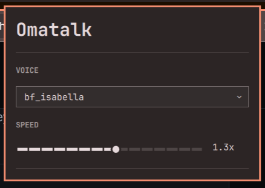

# Omatalk

Local text-to-speech for [Omarchy](https://omarchy.org). Select text, press a
hotkey, hear it read back. The reverse of dictation: instead of you talking to
the machine, it talks to you. Fully local, no network calls at runtime.

## How it works

1. Highlight text anywhere in Hyprland.
2. Press `F8`, next to Omarchy's `F9` dictation key: F9 speaks you, F8 speaks
   back.
3. Omatalk reads the highlighted text, or the clipboard if nothing is
   selected. It streams the text in batches through
   [Kokoro-82M](https://huggingface.co/hexgrad/Kokoro-82M) (ONNX, CPU) and
   plays over PipeWire as each batch is synthesized. The first batch is a
   few words, so you hear speech about a third of a second after the press.
4. Press `F8` again while it's speaking to interrupt. If the selection hasn't
   changed, speech just stops. If it has, the playing Utterance cuts off and
   the new one starts.

On Omarchy, the bar shows a megaphone in the normal bar color and switches it to
the active color while Omatalk is speaking.

## Bar states

The bar keeps one megaphone icon in the same spot and changes its color:

- `not installed`: normal bar color; tooltip says Omatalk is not installed.
  The panel links to the install instructions.
- `idle`: normal bar color; the Daemon is ready.
- `speaking`: theme accent; selected text is being read.
- `unavailable`: urgent color after a 3-second disconnect grace period, only
  once the Daemon has been installed.

The live bar context is softened around the Omatalk glyph so the state colors are easy to spot.

### Idle

The Daemon is ready and the icon uses the normal bar color.


### Speaking

Omatalk is reading the current selection in the theme accent color.


### Unavailable

The Daemon has been disconnected long enough to show the urgent color.


## Install

Omatalk has two parts: the Daemon, which does the speaking, and the bar
plugin, the megaphone and voice panel. One command installs both:

```sh
curl -fsSL https://omatalk.zerobearing.com/install.sh | bash
```

Models are about 355MB. If you added the plugin from the Omarchy
Marketplace first, its panel links to these steps; run the command above and it keeps
the plugin you have.

**Bar plugin only.** The installer already adds it. Use this only if that
failed or you removed the plugin; it does nothing without the Daemon:

```sh
omarchy plugin add https://github.com/zerobearing2/omarchy-omatalk-plugin.git --enable
```

The script downloads a pinned GitHub release tarball (SHA-256 is in the
script, not fetched beside the file). The tarball holds the `omatalk` binary
and its systemd user unit. Then the script:

1. Checks system dependencies and installs any missing ones via
   `omarchy pkg add` (curl, pipewire, wl-clipboard, onnxruntime-cpu,
   espeak-ng, libnotify).
2. Downloads the Kokoro-82M fp32 model and voice files (~355MB) to
   `~/.local/share/omatalk/models/`, skipped when their checksums match.
   The download runs while any existing Daemon is still running, because
   the Daemon reads models only at startup.
3. Stops any existing Daemon, installs the binary as `~/.local/bin/omatalk`,
   and installs and enables a fresh `omatalk.service` systemd user unit, so
   the new Daemon is running before the command exits. An upgrade from a
   0.5 Python install deletes its venv, source, and fp16 model.
4. Runs `omarchy plugin add` for
   https://github.com/zerobearing2/omarchy-omatalk-plugin if the plugin is
   missing, or converts a leftover file copy the same way. An existing git
   checkout is left alone. QML is not in this tarball. When no Omatalk
   binding is present, it asks to bind F8 in `~/.config/hypr/bindings.lua`
   and appends the line on yes. On no, or when F8 is already bound to
   something else, it leaves the file alone and prints a copy-paste command.

Releases are cut with `make bump` then `make release` on `master`, so
several PRs can land before anyone ships. Bump only edits the version
file. Release builds the tarball, verifies it, commits, pushes, and
publishes the GitHub release from those files. The bar plugin releases on
its own, from its own repository. After the first run, `omatalk upgrade` fetches and runs the installer that
shipped with the latest GitHub release.

The script at that URL is a small dispatcher: it fetches and runs the
installer that shipped with the latest release, so the installer's own
logic and the binary it installs are always a matched pair. To run
unreleased work, see [Development](#development).

Upgrades never create, merge, rewrite, or delete `~/.config/omatalk/config.toml`.
An existing config stays byte-for-byte unchanged, and an absent config stays
absent.

The bar widget lives in [omarchy-omatalk-plugin](https://github.com/zerobearing2/omarchy-omatalk-plugin).
`omarchy plugin update zerobearing.omatalk` updates QML only. Daemon updates
stay `omatalk upgrade` (or the site curl). `omarchy plugin remove
zerobearing.omatalk` unloads the megaphone and deletes the plugin checkout; it
leaves the Daemon, models, and config. F8 still speaks.

## Uninstall

```sh
omatalk uninstall
```

Runs the uninstaller built into the installed binary. If the
`omatalk` command is already gone, use the site copy:

```sh
curl -fsSL https://omatalk.zerobearing.com/uninstall.sh | bash
```

Stops and removes the systemd unit, the `omatalk` binary, and the
Omarchy bar plugin. Asks before deleting the models (~355MB) and your config.
Also a thin dispatcher to the latest release uninstaller.
Asks before removing the Omatalk binding from `~/.config/hypr/bindings.lua`
(default no). Plugin remove is not uninstall.

## Usage

```sh
omatalk speak                       # capture and speak (what the hotkey runs)
omatalk speak "text here"           # speak given text
omatalk speak --voice af_bella "hi" # speak once in a voice, default unchanged
omatalk stop                        # cut off the current utterance
omatalk status                      # idle | speaking | error
omatalk version                     # print the installed release (--version works too)
omatalk upgrade                     # install the latest release
omatalk uninstall                   # remove Omatalk (asks about models, config, F8)
omatalk config get [--json]         # print the effective config
omatalk config set voice af_bella   # set voice or speed; auto-applies
omatalk config set speed 1.25       # (0.5-2.0)
omatalk config voices [--json]      # list available voice names
omatalk daemon                      # run the Daemon (the unit's ExecStart)
```

`systemctl --user start|stop|restart omatalk` controls the daemon.

When the daemon is down, `speak` and `stop` raise a desktop notification
alongside the terminal error — they run from hotkeys, where there may be no
terminal to read. `status` only prints the error, so scripts and installers
can poll it silently.
`journalctl --user -u omatalk -f` shows logs.

## Bluetooth and HDMI audio

Bluetooth speakers and HDMI or DisplayPort monitors mute for about half a
second after they wake. Their sink suspends after 5 seconds of silence, so on
these devices nearly every F8 press wakes them. You choose how Omatalk
handles that gap:

| You want | Do this | Result |
|---|---|---|
| Power saving (default) | Nothing | A press to a sleeping device waits about 0.65 s. The first word is intact. |
| No wait and no clipping | [Disable sink suspend](#disable-sink-suspend) | Speech starts at once, every time. The device never sleeps. |
| No wait, clipping is fine | Set `wake_lead_ms = 0` | Speech starts at once. After 5 s of silence the first word may be lost. |

Analog speakers and headphones are not affected. They play from the first
sample, so Omatalk never waits for them.

### How the lead works

When the device wakes, its link comes back within about 50 ms, but the
device stays muted for another 375 to 550 ms. Nothing tells software when it
is ready, so speech sent in that window is lost.

At each press, Omatalk runs `pactl get-default-sink` and `pactl list sinks
short`. If the default sink is `SUSPENDED` and is Bluetooth (`bluez_output.*`)
or HDMI (a name containing `hdmi`, which includes DisplayPort), it plays
`wake_lead_ms` of silence before the speech. Every other case gets no lead:
a sink that is already awake, an analog sink, or a `pactl` that fails or
takes longer than 150 ms.

```toml
# ~/.config/omatalk/config.toml
wake_lead_ms = 650   # the default; 0 to 2000; 0 turns the lead off
```

If the first word is still clipped, raise `wake_lead_ms` in steps of 100.

### Disable sink suspend

With suspend off, the device never sleeps, so Omatalk never adds the lead
and nothing is clipped. Create
`~/.config/wireplumber/wireplumber.conf.d/51-disable-suspend.conf`:

```
monitor.alsa.rules = [
  {
    matches = [ { node.name = "~alsa_output.*" } ]
    actions = { update-props = { session.suspend-timeout-seconds = 0 } }
  }
]
monitor.bluez.rules = [
  {
    matches = [ { node.name = "~bluez_output.*" } ]
    actions = { update-props = { session.suspend-timeout-seconds = 0, node.suspend-on-idle = false } }
  }
]
```

Then run `systemctl --user restart wireplumber`.

Bluetooth also needs `node.suspend-on-idle = false`; setting the timeout
alone did not keep it awake. Suspend is on by default to save power, which
matters on a laptop and for a battery speaker.

## Troubleshooting

The red megaphone means `unavailable`. The widget has either received the
daemon's `error` state or has lost its `follow` socket connection for more than
three seconds. It does not mean that speech is active.

Run these commands on the affected machine and keep their output together:

```sh
omatalk version
omatalk status
systemctl --user status omatalk.service --no-pager -l
journalctl --user -u omatalk.service -b --no-pager -n 80
stat -c '%A %U:%G %n' "${XDG_RUNTIME_DIR:-/run/user/$UID}/omatalk/omatalk.sock" \
  ~/.config/omarchy/plugins/zerobearing.omatalk/manifest.json \
  ~/.config/omarchy/plugins/zerobearing.omatalk/BarWidget.qml
ss -xap | grep -E 'omatalk|quickshell'
omarchy plugin list --json | grep -C 3 'zerobearing.omatalk'
omarchy-shell shell listPlugins | grep -C 3 'zerobearing.omatalk'
```

Record which symptom you see: the icon is missing, present and red, present and
normal, or changes color while F8 still fails. Also record whether F8 works,
and when the problem started, especially after install, upgrade, or a shell
restart. The widget needs both a running daemon and a live Quickshell
connection to the daemon socket.

If the first word is clipped on Bluetooth or HDMI, see
[Bluetooth and HDMI audio](#bluetooth-and-hdmi-audio).

If the journal shows the Daemon exiting at startup with a library error,
check that `onnxruntime-cpu` and `espeak-ng` are installed:
`omarchy pkg present onnxruntime-cpu espeak-ng`. The Daemon loads
`libonnxruntime.so.1` and `libespeak-ng.so.1` at startup. To use another
onnxruntime build, set `ORT_DYLIB_PATH` to its library in the unit's
environment.

After collecting the evidence, start an inactive daemon with
`systemctl --user start omatalk.service`. The widget reconnects to the socket
on its own within a few seconds of the daemon coming up or restarting — no
shell action needed. If `omatalk status` works and several seconds have
passed but the socket still has no Quickshell peer, the plugin itself likely
failed to load; check for a QML error and run `omarchy restart shell`.

### Prompt for a local agent

Paste this into an agent running on the affected machine:

```text
Debug my Omatalk installation and report the root cause. The symptom is:
<describe missing, red, normal, or wrong-color icon; say whether F8 works>

Run the Omatalk troubleshooting commands from README.md. Capture the current
time and separate these checks:

1. What does `omatalk version` print?
2. Is omatalk.service active and does `omatalk status` work?
3. Is the socket present, and is a Quickshell process connected to it?
4. Is zerobearing.omatalk present, discovered, and enabled?
5. Do recent systemd or Quickshell logs show a QML/plugin load error?

Preserve ~/.config/omatalk/config.toml, ~/.config/hypr/bindings.lua, and the
Omarchy shell layout. Ask before making changes. Use the smallest targeted
repair, then verify both `omatalk status` and the Quickshell socket connection.
Do not call the problem fixed without saying what evidence proved it.

Return this report:

Symptom:
Observed state: (include `omatalk version`)
Evidence:
Root cause:
Commands or files changed:
Verification:
Remaining uncertainty:

Redact credentials, tokens, and unrelated private log content before sharing
the report.
```

## Config

Click the bar icon to open the voice/speed panel, or use `omatalk config`
(see Usage above). Both save to `~/.config/omatalk/config.toml`. The file
does not exist until you set something, and every key is optional.

`omatalk config get` prints every setting with the value in effect,
defaults included, so it is the quickest way to see what you can change.
Voice and speed have `config set`. Edit the file by hand for the rest.

Each press reads the file again, so changes apply to the next Utterance
with no restart. A Stream already playing keeps the settings it started with.

| Key | Default | What it does |
|---|---|---|
| `voice` | `"af_heart"` | Voice for every Utterance. `omatalk config voices` lists the names. |
| `speed` | `1.0` | Speech rate, 0.5 to 2.0. |
| `wake_lead_ms` | `650` | Silence before speech on a suspended Bluetooth or HDMI sink, 0 to 2000. 0 turns it off. See [Bluetooth and HDMI audio](#bluetooth-and-hdmi-audio). |
| `capture_primary` | `["wl-paste", "--primary"]` | Command that prints the selection. |
| `capture_clipboard` | `["wl-paste"]` | Command that prints the clipboard, used when nothing is selected. |
| `player` | `["pw-cat", "-p", "--raw", "--format", "s16"]` | Command that plays raw s16le mono from stdin. Omatalk appends `--rate 24000 --channels 1 -`. |
| `notify` | `["notify-send", "Omatalk"]` | Command for desktop notifications. The message is appended as the last argument. |
| `sink_probe` | `["pactl"]` | pactl-compatible command for the sink check. Omatalk appends `get-default-sink`, then `list sinks short`. |
| `lang` | `"en-us"` | Accepted for compatibility. Every value reads as `en-us`, the only language. |

Commands are lists of strings, not shell lines. A bad value makes the press
fail with a notification naming the key, for example
`config.toml: speed must be between 0.5 and 2.0`. Unknown keys are ignored.

```toml
voice = "af_bella"
speed = 1.25
wake_lead_ms = 800
```

Picking a voice in the panel immediately speaks a short sample in it, so you
can compare voices without leaving the panel. `omatalk speak --voice <name>
"text"` does the same from a terminal or a script, for one Utterance, without
touching your configured default.



Prerecorded samples of every voice are on the
[project site](https://omatalk.zerobearing.com).

## Architecture

```
┌───────────────────┐   ┌─────────────────┐
│ bindings.lua (F8) │──▶│ one-shot client │
└───────────────────┘   └─────────────────┘
                                 │
                                 ▼
                    Unix socket (omatalk.sock)
                                 │
                                 ▼
┌───────────────────────────────────────────┐
│      omatalk daemon · systemd --user      │
│ capture:  wl-paste --primary → wl-paste   │
│ g2p:      misaki (Rust port) → phonemes   │
│ batches:  short first, then up to 510     │
│ engine:   Kokoro-82M · ONNX Runtime · CPU │
│ player:   pw-cat → PipeWire (streamed)    │
└───────────────────────────────────────────┘
```

The hotkey runs a one-shot client that sends a command over the socket; the
daemon does the rest. Its protocol verbs (`speak` / `stop` / `status`) and the
streaming `follow` command are the single seam: clients, the bar, tests, and
any future rewrite all go through it.

## Development

The Daemon and the CLI are one Rust crate. `omatalk daemon` is the Daemon;
every other argument list is the CLI. `cargo test` runs the unit tests and
the black-box tests in `tests/`, which drive the built binary and the shell
scripts.

```sh
cargo test      # unit, actor, and black-box tests
make lint       # cargo fmt --check, clippy
make format     # cargo fmt
```

Tests need neither onnxruntime nor espeak-ng: `OMATALK_TEST_FAKE_ENGINE=1`
replaces the speech engine. Tests that need the real libraries and models
are ignored by default. Run them with `cargo test --release -- --ignored`.

The G2P parity tools in `tools/parity/` regenerate the reference data in
`data/` from Python spaCy and misaki. Each is a standalone uv script with
pinned dependencies, so run it directly, for example
`tools/parity/dump_misaki.py lines.txt out.jsonl`. They are not part of the
test suite.

To dogfood a local build, run `scripts/dev-install.sh`. It builds the release
binary, replaces `~/.local/bin/omatalk` with it, installs this tree's unit,
and restarts the Daemon. It does not download models. Run the installer
once first. To go back to the latest release, run `omatalk upgrade`.

## Design docs

- [Domain language](CONTEXT.md)
- [ADRs](docs/adr/)

## Credits

The voice is [Kokoro-82M](https://huggingface.co/hexgrad/Kokoro-82M) by
[hexgrad](https://github.com/hexgrad/kokoro). Omatalk downloads the ONNX
export published by [kokoro-onnx](https://github.com/thewh1teagle/kokoro-onnx)
by [thewh1teagle](https://github.com/thewh1teagle). Phonemes come from a Rust
port of [misaki](https://github.com/hexgrad/misaki), Kokoro's G2P library,
and the spaCy `en_core_web_sm` tokenizer and tagger.

Built for [Omarchy](https://omarchy.org) by DHH
([source](https://github.com/omacom/omarchy)).

## License

MIT
